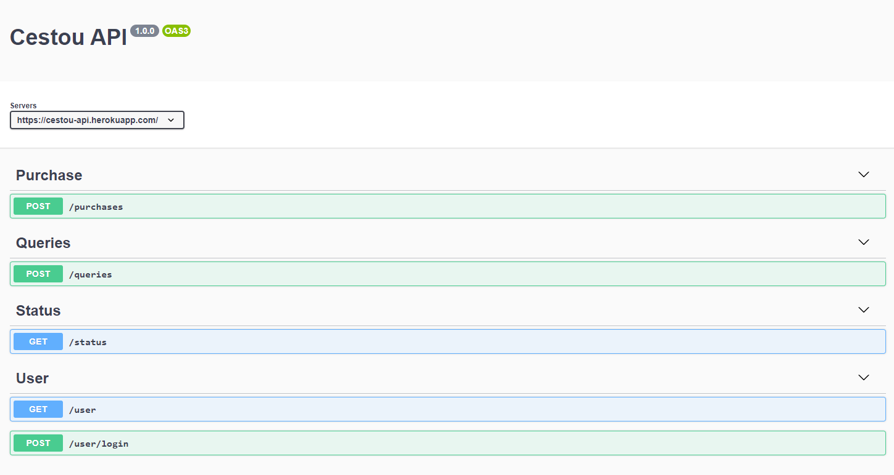
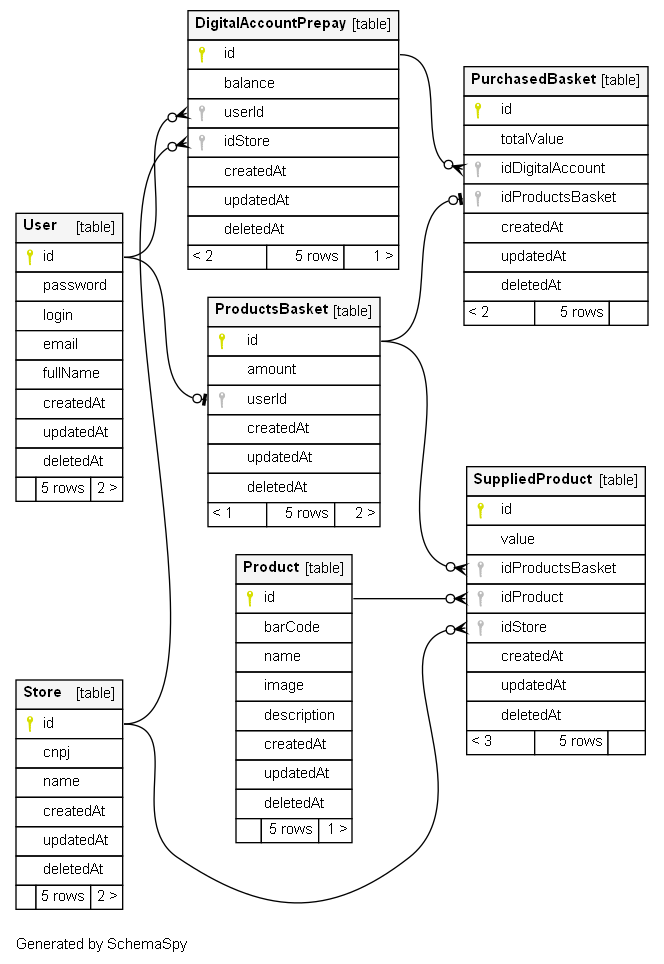

# Cestou API

### Compras online em lojas da sua confiança com crédito pré-pago

## Heroku
#### URL Base: `https://cestou-api.herokuapp.com/`

## Getting Started
1. Navegue até a pasta raiz
#### `$ cd cestou-api`

2. Instale as dependências
#### `$ yarn` ou `$ npm install`

#### `$ npm install -g nodemon`

3. Instale o PostgreSQL mais recente

4. Renomeie o arquivo .env-example para .env

5. Configure-o

6. Execute o servidor
#### `$ npm run watch`

7. Acesse:
#### `http://localhost:5445/docs`

### Mais sobre o backend

#### Ao executar, a api irá fornecer um link de documentação mais técnico (feito em Open API 3):

Na sessão "Purchase", temos um método post (/buyBasket/:idProductsBasket) que é um extra que implementamos. Ele se encaixa na nossa ideia de Loja Bank. Dado uma cesta de produtos e uma conta digital cadastrada, eu realizo a compra dessa cesta.

### Modelo ER Conceitual:

### Modelo ER Lógico:

